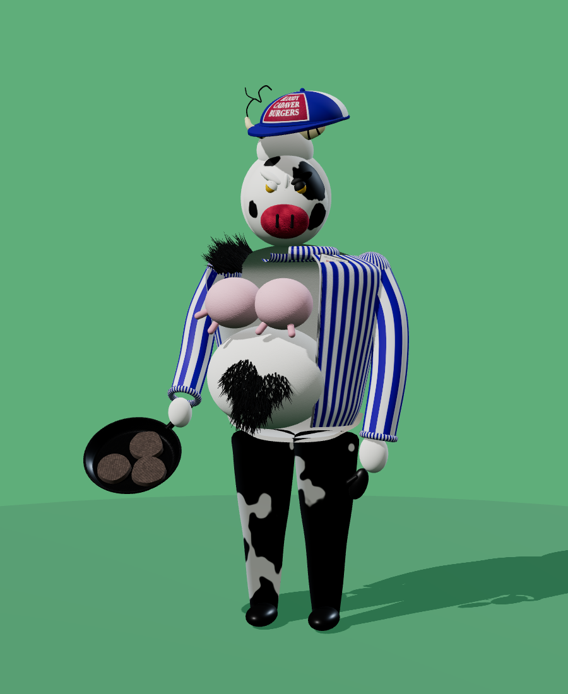

# Bovina 3D

A 3D model of Bovina, the "Bloody Cadaver Burgers" cow character, built from the reference photo.

| File | What it is |
| --- | --- |
| `bovina.glb` | The model as a glTF 2.0 binary, about 1.85 units tall, feet on the ground, facing +Z. Opens in Blender (File › Import › glTF 2.0), Windows 3D Viewer, macOS Preview/Reality Composer, or https://gltf-viewer.donmccurdy.com. |
| `bovina.js` | The source. `createBovina()` builds the character in Three.js from primitives and procedurally painted textures. Change a shape or colour here and re-export. |
| `index.html` | An interactive viewer (orbit, zoom, auto-rotate). Serve the folder over HTTP, e.g. `npx serve bovina-3d`, and open it. It loads three.js from jsDelivr. |

## What's modelled

- Mask with black cow patches, scowling brows, yellow eyes, fuzzy red muzzle with slit nostrils
- Ringed stubby horns, the wiry whisker, fur topknot, trucker cap with the "BLOODY CADAVER BURGERS" patch
- Furry torso and belly, black belly and shoulder hair (individual strands), pink udders with teats
- Open blue-and-white striped track jacket with zipper, collar and the "HELLO MY NAME IS BOVINA" tag
- White mittens, black glove, briefs, black cow-patched pants, shoes
- Frying pan with three grill-marked patties

Every part is a separately named mesh and material (`Cap`, `FryingPan`, `Jacket`, `Muzzle`, …), so they can be recoloured, hidden or re-posed in Blender.

## Limitations

The model is built from smooth primitives, not sculpted, so it's a stylised stand-in rather than a scan of the costume. It isn't rigged; for animation, add an armature in Blender. Fur is suggested with normal maps and sheen plus strand geometry for the black hair, not a hair system.

## Re-exporting

`bovina.glb` was exported from `createBovina()` with three.js's `GLTFExporter` (`{ binary: true }`) in a browser. Do the same after editing `bovina.js`.
